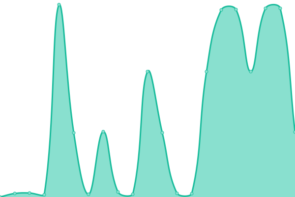
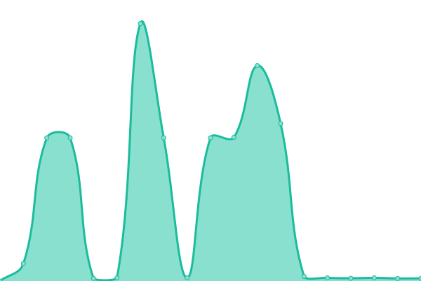
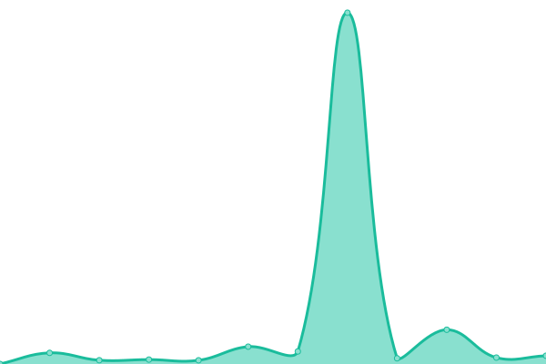

# [📈 Live Status](https://VPNHELP.github.io/uptime): <!--live status--> **🟧 Partial outage**

This repository contains the open-source uptime monitor and status page for [VPNHELP](https://VPNHELP.github.io/uptime), powered by [Upptime](https://github.com/upptime/upptime).

With [Upptime](https://upptime.js.org), you can get your own unlimited and free uptime monitor and status page, powered entirely by a GitHub repository. We use [Issues](https://github.com/VPNHELP/uptime/issues) as incident reports, [Actions](https://github.com/VPNHELP/uptime/actions) as uptime monitors, and [Pages](https://VPNHELP.github.io/uptime) for the status page.

<!--start: status pages-->
<!-- This summary is generated by Upptime (https://github.com/upptime/upptime) -->
<!-- Do not edit this manually, your changes will be overwritten -->
<!-- prettier-ignore -->
| URL | Status | History | Response Time | Uptime |
| --- | ------ | ------- | ------------- | ------ |
|  🇩🇪 DE [1] | 🟥 Down | [de-1.yml](https://github.com/VPNHELP/uptime/commits/HEAD/history/de-1.yml) | 

 7215ms
     
 | 

<a href="https://VPNHELP.github.io/uptime/history/de-1">81.90%</a>
    

|  🇩🇪 DE [2] | 🟩 Up | [de-2.yml](https://github.com/VPNHELP/uptime/commits/HEAD/history/de-2.yml) | 

 5489ms
     
 | 

<a href="https://VPNHELP.github.io/uptime/history/de-2">94.34%</a>
    

|  🇩🇪 DE [3] | 🟩 Up | [de-3.yml](https://github.com/VPNHELP/uptime/commits/HEAD/history/de-3.yml) | 

 3293ms
     
 | 

<a href="https://VPNHELP.github.io/uptime/history/de-3">98.26%</a>
    

|  🇩🇪 DE [4] | 🟩 Up | [de-4.yml](https://github.com/VPNHELP/uptime/commits/HEAD/history/de-4.yml) | 

 1927ms
     
 | 

<a href="https://VPNHELP.github.io/uptime/history/de-4">99.16%</a>
    

|  🏴󠁧󠁢󠁥󠁮󠁧󠁿 EN [1] | 🟩 Up | [en-1.yml](https://github.com/VPNHELP/uptime/commits/HEAD/history/en-1.yml) | 

 222ms
     
 | 

<a href="https://VPNHELP.github.io/uptime/history/en-1">96.70%</a>
    

|  🇫🇮 FI [1] | 🟩 Up | [fi-1.yml](https://github.com/VPNHELP/uptime/commits/HEAD/history/fi-1.yml) | 

 583ms
     
 | 

<a href="https://VPNHELP.github.io/uptime/history/fi-1">96.60%</a>
    

|  🇫🇮 FI [2] | 🟩 Up | [fi-2.yml](https://github.com/VPNHELP/uptime/commits/HEAD/history/fi-2.yml) | 

 1115ms
     
 | 

<a href="https://VPNHELP.github.io/uptime/history/fi-2">98.89%</a>
    

<!--end: status pages-->

[**Visit our status website →**](https://VPNHELP.github.io/uptime)

## 📄 License

- Powered by: [Upptime](https://github.com/upptime/upptime)
- Code: [MIT](./LICENSE) © [Anand Chowdhary](https://anandchowdhary.com), supported by [Pabio](https://pabio.com)
- Data in the `./history` directory: [Open Database License](https://opendatacommons.org/licenses/odbl/1-0/)
